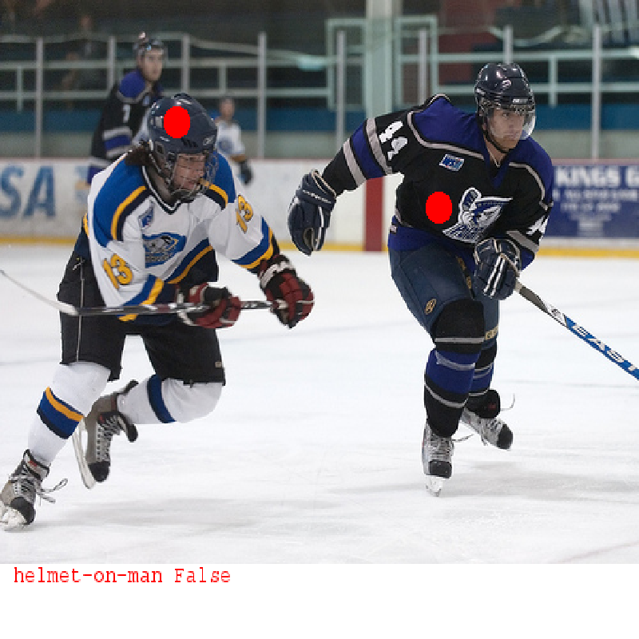

HOW TO BEAT THE ROBOT
=====================

Knowing how the robot works helps you beat it.  
Since the robot cannot see the image, it's easy to fool it using relations that sound true.  
I suggest that you first pick any two objects in the image, then think about this question:  
`What relations are likely between these two objects?".`  
**Please notice that the relation you pick must be false in the image.**

Here is a good example:  
*Helmet on man* sounds very plausible, but the helmet is actually not on that man in the image.

