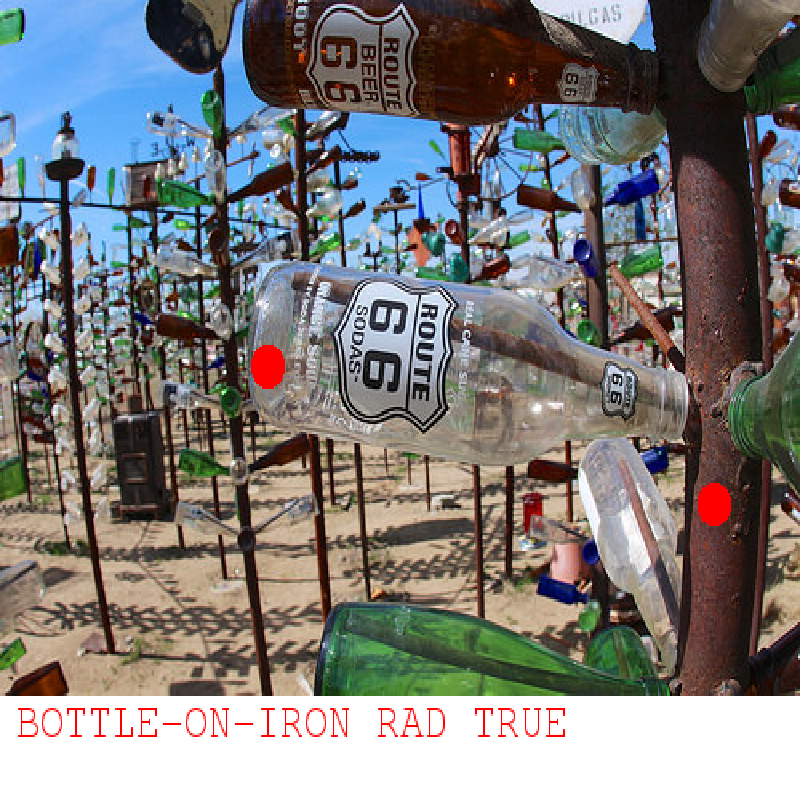
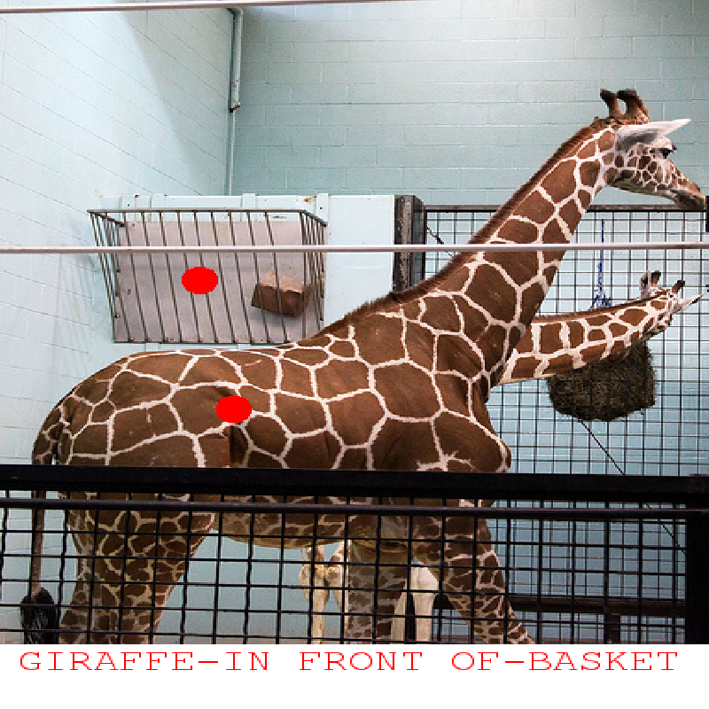
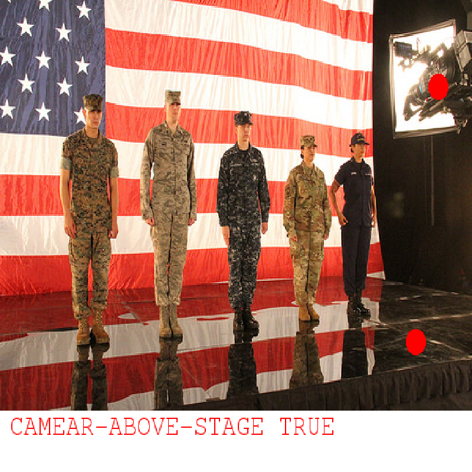
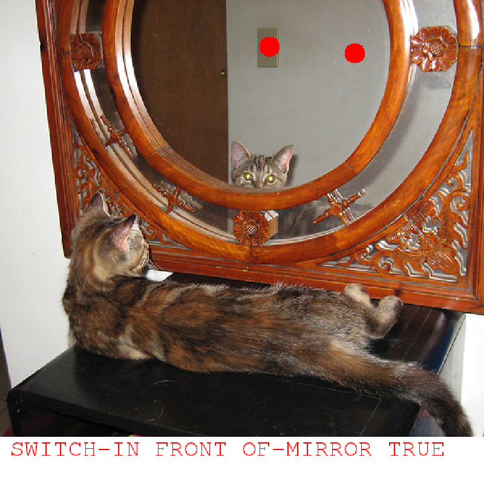
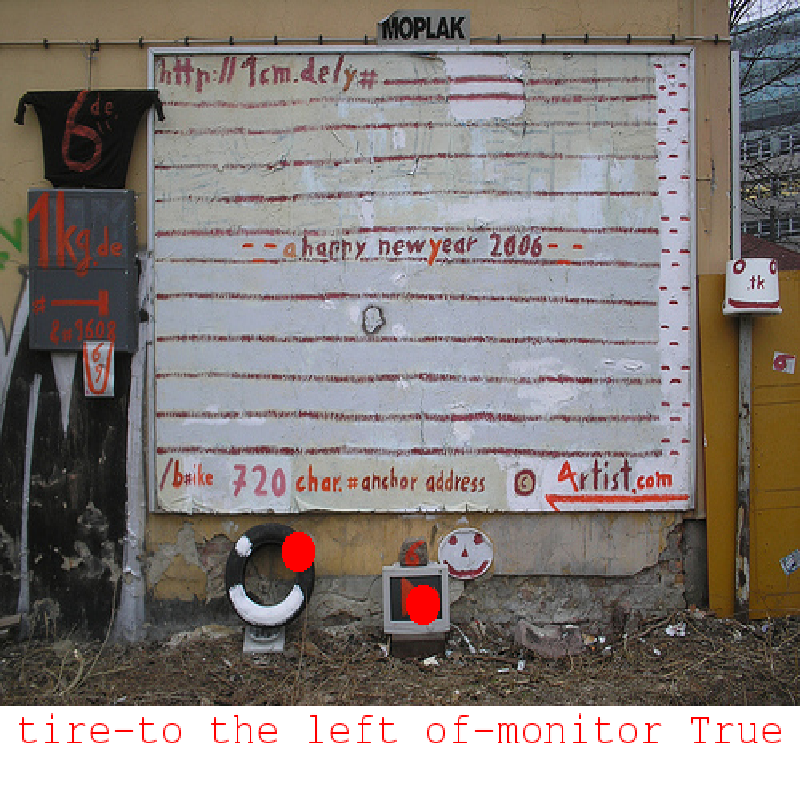
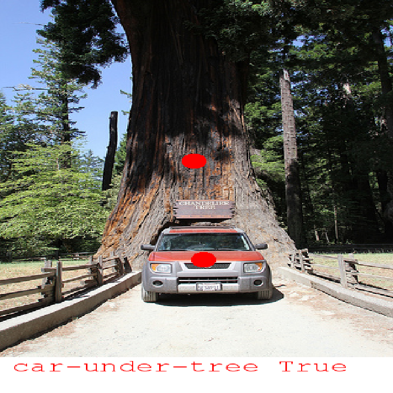

HOW TO BEAT THE ROBOT
=====================

Knowing how the robot works helps you beat it.  
The robot decides whether or not to believe in a relation using two methods:
1. language 
2. 2D configuration

Each time the robot wins, it will tell you how the decision was made.

## Language

The robot will believe in it if the relation is a common one, such as *car on road*, *book on table*, *man in front of building*.   
So you would want to avoid these easy relations and pick some interesting ones, for example, *man under car*.  
**But please be aware that the relation you pick must be true in the image, otherwise it leads to a rejection.**  
Here we show some good examples that the robot didn't expect:

These examples are good because it's hard to tell whether they holds without actually seeing the image.

## 2D configuration

In addition to language, the robot also consider the 2D configuration.  
We illustate this with two bad examples:

These two examples are easy for the robot to guess, because the 2D positions of these points tell us the relation *to the left of* and *under* are likely to be true.  
However, you can also use this to your advantage, below is a good example: The robot won't believe the *candle to the right of man* given the 2D points, but it's actuall true.

